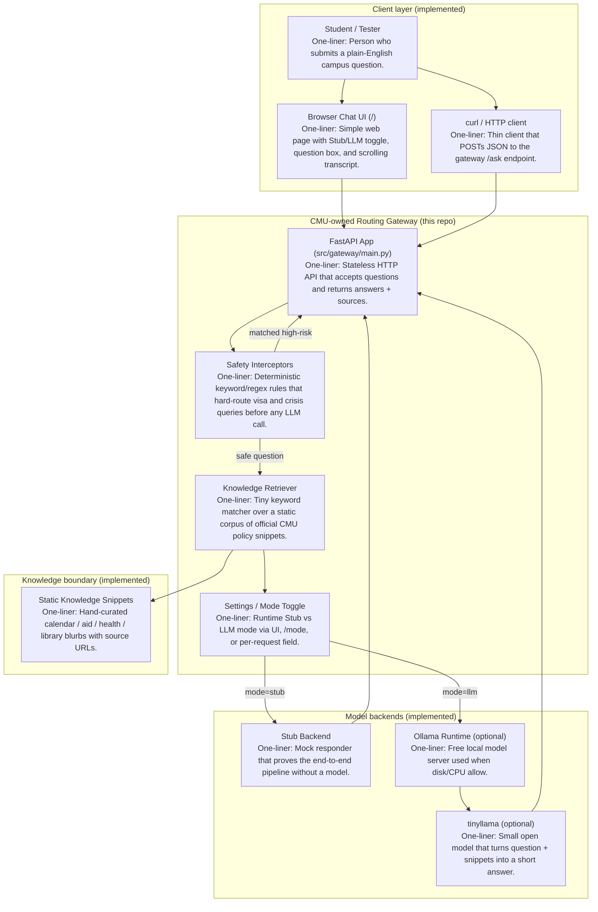

# Architecture Diagram — Current State (Implemented Prototype)

This diagram shows **only what runs in the repo today** (Learner Lab / Devcontainer / local).  
No AWS API Gateway, Lambda, or managed cloud LLM.

## Component map

## Component checklist (label + one-liner)

| Component | One-line description |
|-----------|----------------------|
| Student / Tester | Person who submits a plain-English campus question. |
| Browser Chat UI | Simple web page with Stub/LLM toggle, question box, and scrolling transcript. |
| curl / HTTP client | Thin client that POSTs JSON to the gateway `/ask` endpoint. |
| FastAPI App | Stateless HTTP API that accepts questions and returns answers + sources. |
| Safety Interceptors | Deterministic keyword/regex rules that hard-route visa and crisis queries before any LLM call. |
| Knowledge Retriever | Tiny keyword matcher over a static corpus of official CMU policy snippets. |
| Settings / Mode Toggle | Runtime Stub vs LLM mode via UI, `/mode`, or per-request field. |
| Static Knowledge Snippets | Hand-curated calendar / aid / health / library blurbs with source URLs. |
| Stub Backend | Mock responder that proves the end-to-end pipeline without a model. |
| Ollama Runtime | Free local model server used when disk/CPU allow. |
| tinyllama | Small open model that turns question + snippets into a short answer. |

## Request path (current)

1. Client opens `/` or `POST /ask` with `{ "question": "...", "mode": "stub"|"llm" }`.
2. Interceptors scan for visa/immigration or mental-health crisis language.
3. If matched → return hard-routed official guidance; **no model call**.
4. If safe + **stub** → return stubbed answer + sources + disclaimer.
5. If safe + **llm** → call Ollama (if reachable and model pulled); otherwise return a clear setup error.
6. Drop server-side session state (browser may keep the chat transcript locally).

## Explicitly not in current state

- AWS API Gateway / Lambda hosting  
- Azure OpenAI / AWS Bedrock  
- Portal-embedded CMU chat chrome, ticket handoff, live handbook crawl  
