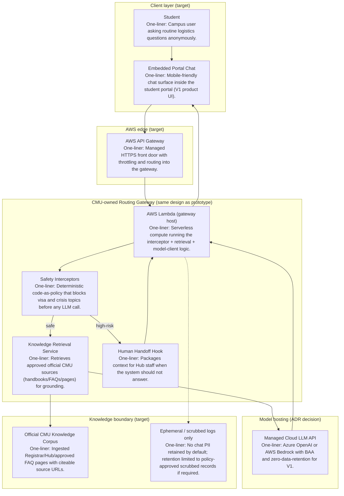

# Architecture Diagram — Future State (ADR / Production Target)

This diagram shows the **intended production / Learner Lab cloud path** from ADR 001.  
It is **not fully deployed** in this checkpoint; the current prototype implements the same gateway pattern locally (see `architecture-diagram-current.md`).

## Component map

## Component checklist (label + one-liner)

| Component | One-line description |
|-----------|----------------------|
| Student | Campus user asking routine logistics questions anonymously. |
| Embedded Portal Chat | Mobile-friendly chat surface inside the student portal (V1 product UI). |
| AWS API Gateway | Managed HTTPS front door with throttling and routing into the gateway. |
| AWS Lambda (gateway host) | Serverless compute running the interceptor + retrieval + model-client logic. |
| Safety Interceptors | Deterministic code-as-policy that blocks visa and crisis topics before any LLM call. |
| Knowledge Retrieval Service | Retrieves approved official CMU sources (handbooks/FAQs/pages) for grounding. |
| Human Handoff Hook | Packages context for Hub staff when the system should not answer. |
| Managed Cloud LLM API | Azure OpenAI or AWS Bedrock with BAA and zero-data-retention for V1. |
| Official CMU Knowledge Corpus | Ingested Registrar/Hub/approved FAQ pages with citeable source URLs. |
| Ephemeral / scrubbed logs | No chat PII retained by default; retention limited to policy-approved scrubbed records if required. |

## Request path (future)

1. Student asks a question in the portal chat.
2. Request enters via API Gateway → Lambda gateway.
3. Interceptors hard-route high-risk topics (OIE / emergency resources / handoff).
4. Safe questions retrieve official corpus snippets, then call the managed LLM API.
5. Answer returns with citations; session state is not kept in the LLM tenant or gateway beyond policy-approved needs.

## Mapping from current prototype

| Current (now) | Future (ADR target) |
|---------------|---------------------|
| FastAPI on Cloud9 / Devcontainer | Same logic on AWS Lambda |
| Direct HTTP / simple UI | API Gateway + portal embed |
| Stub or local Ollama | Managed enterprise LLM API |
| Static in-code snippets | Ingested official web/handbook corpus |
