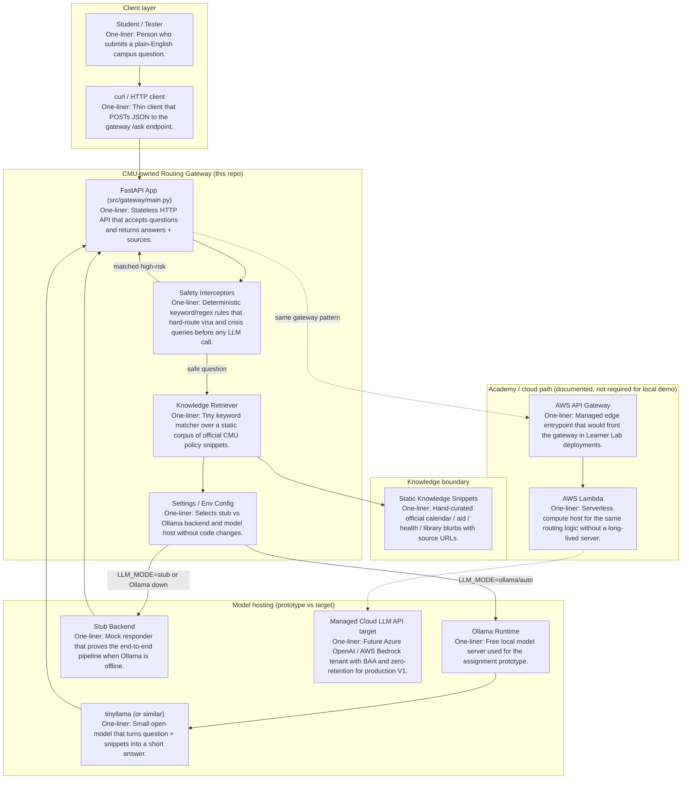

# Architecture Diagram — V1 Minimal Q&A Prototype

Labeled starting architecture for the student-support question-answering capability. Every box has a one-line description.

## Component map

## Component checklist (label + one-liner)

| Component | One-line description |
|-----------|----------------------|
| Student / Tester | Person who submits a plain-English campus question. |
| curl / HTTP client | Thin client that POSTs JSON to the gateway `/ask` endpoint. |
| FastAPI App | Stateless HTTP API that accepts questions and returns answers + sources. |
| Safety Interceptors | Deterministic keyword/regex rules that hard-route visa and crisis queries before any LLM call. |
| Knowledge Retriever | Tiny keyword matcher over a static corpus of official CMU policy snippets. |
| Settings / Env Config | Selects stub vs Ollama backend and model host without code changes. |
| Static Knowledge Snippets | Hand-curated official calendar / aid / health / library blurbs with source URLs. |
| Ollama Runtime | Free local model server used for the assignment prototype. |
| tinyllama | Small open model that turns question + snippets into a short answer. |
| Stub Backend | Mock responder that proves the end-to-end pipeline when Ollama is offline. |
| Managed Cloud LLM API (target) | Future Azure OpenAI / AWS Bedrock tenant with BAA and zero-retention for production V1. |
| AWS API Gateway (path) | Managed edge entrypoint that would front the gateway in Learner Lab deployments. |
| AWS Lambda (path) | Serverless compute host for the same routing logic without a long-lived server. |

## Request path (happy path)

1. Client `POST /ask` with `{ "question": "..." }`.
2. Interceptors scan for visa/immigration or mental-health crisis language.
3. If matched → return hard-routed official guidance; **no model call**.
4. If safe → retrieve 1–2 knowledge snippets → call Ollama (or stub) → return answer + source URLs + disclaimer.
5. Drop session state (nothing persisted).
